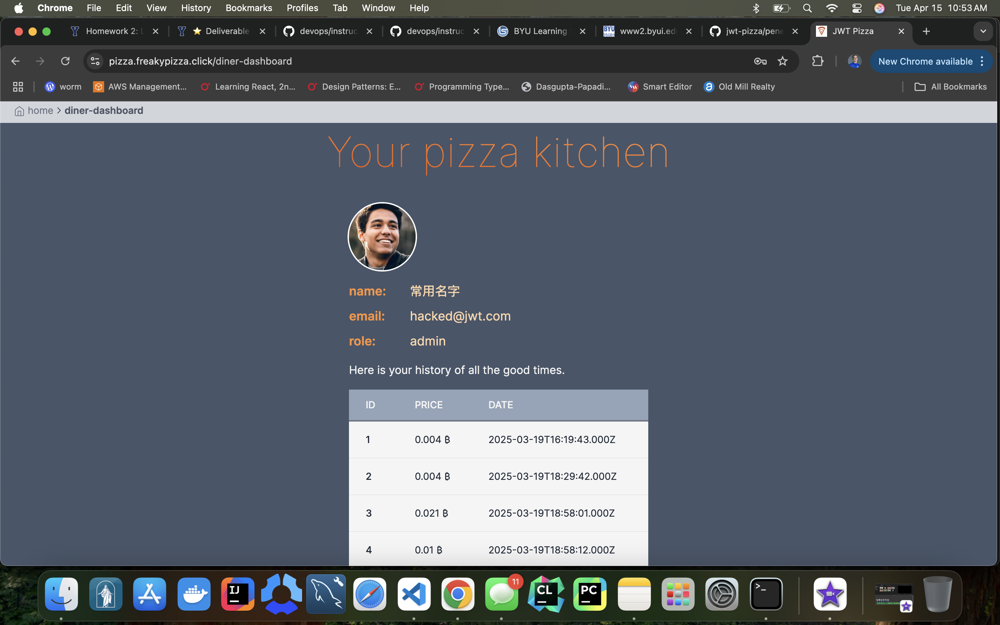

# penetration test report

## name

- Luke Grundvig

## Self Attack

### self attack record

| Item           | Result                                                                        |
| -------------- | ----------------------------------------------------------------------------- |
| Date           | April 15, 2025                                                                |
| Target         | pizza.freakypizza.click                                                       |
| Classification | Injection                                                                     |
| Severity       | 1                                                                             |
| Description    | SQL injection changed admin password and email. Hacker can now add franchises |
| Images         |    Email changed for admin                   |
| Corrections    | Sanitize user inputs.                                                         |

## what I learned

I learned that it's important to check for sql injection vuleribility in code that's given to me. I wouldn't write it into my own code, but if you plan on using something someone else wrote you need to be sure they follwed good practices. It's never safe to not sanatize user inputs, it's one of the most commonly used hacks, and it's severity is very high, you can lose control of the entire system, and have many things erroneously added to the system.
